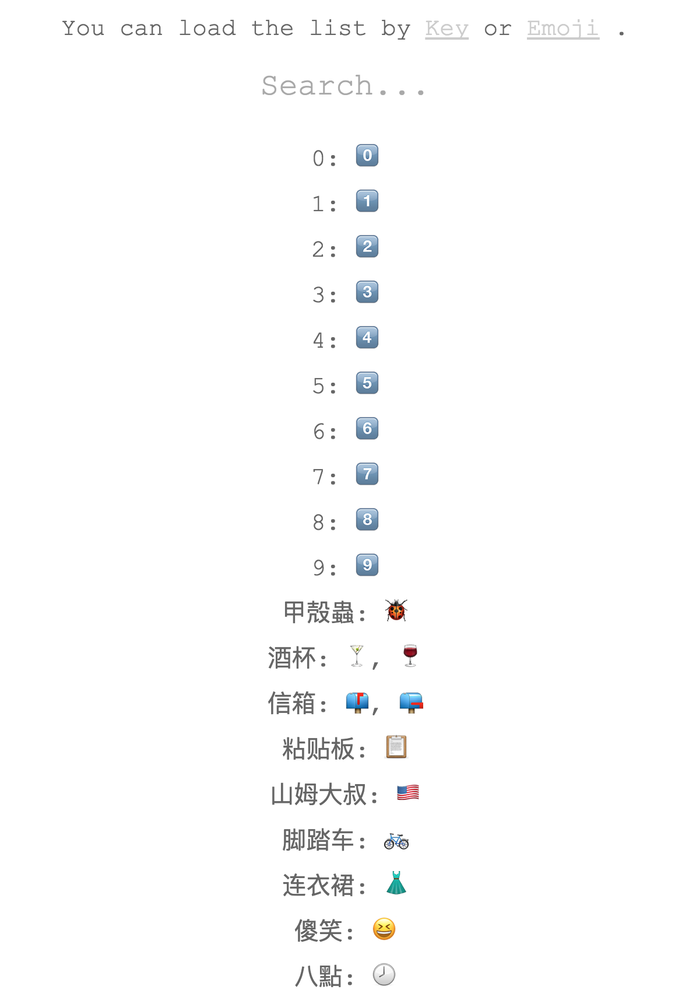

# Emoji 查询工具

## 功能

1. 以文字为索引的列表
1. 以 emoji 为索引的列表
1. 通过文字或 emoji 进行查询
    - 支持模糊匹配
1. 内附 emoji.plist(xml) 转 json [工具](tool)

## 声明

该项目基于 OS X 10.11 中文输入法中的 emoji.plist 文件作为数据来源，
OS X 10.11.1 以后的系统该 emoji.plist 文件已不存在，故后期的新 Emoji
并未包含。

## 参考

- [知乎：iOS 和 Mac 上能用拼音打出的 Emoji 有哪些？](https://www.zhihu.com/question/26786869/answer/64265262)
- [Get Emoji](http://getemoji.com/)
- [Emojipedia](http://emojipedia.org/)
- [dofy/EmojiDB](https://github.com/dofy/emojidb)

## 截图

---

---

---

